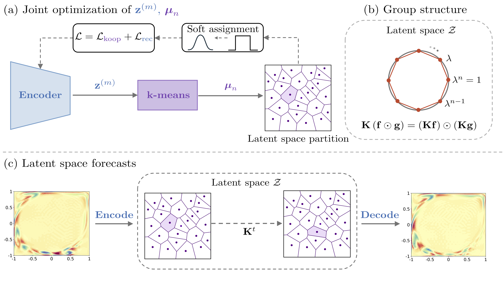

# Deep Embedded Multiplicative DMD for Algebra-Preserving Koopman Learning

This repository contains the code for the paper [Deep Embedded Multiplicative DMD for Algebra-Preserving Koopman Learning](https://arxiv.org/pdf/2606.05131) by Kelan Gray, Finlay Brown, Nicolas Boullé and Matthew J. Colbrook.

<p align="center">
  <a target="_blank" rel="noopener noreferrer" href="img/pipeline.png">
    
  </a>
</p>

---

## 📁 Dataset

The dataset accompanying the code is available on Zenodo at [https://zenodo.org/records/20747990](https://zenodo.org/records/20747990).

---

## 📖 Citation

If you find this work useful in your research, please consider citing:

```bibtex
@article{gray2026deep,
  title={Deep Embedded Multiplicative DMD for Algebra-Preserving Koopman Learning},
  author={Gray, Kelan and Brown, Finlay and Boull{\'e}, Nicolas and Colbrook, Matthew J},
  journal={arXiv preprint arXiv:2606.05131},
  year={2026}
}
```